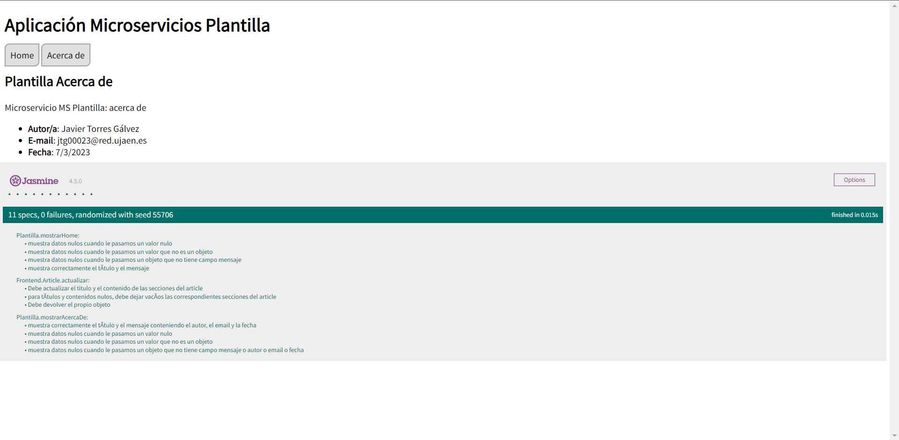
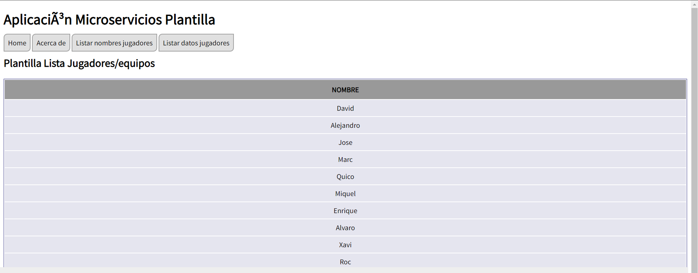
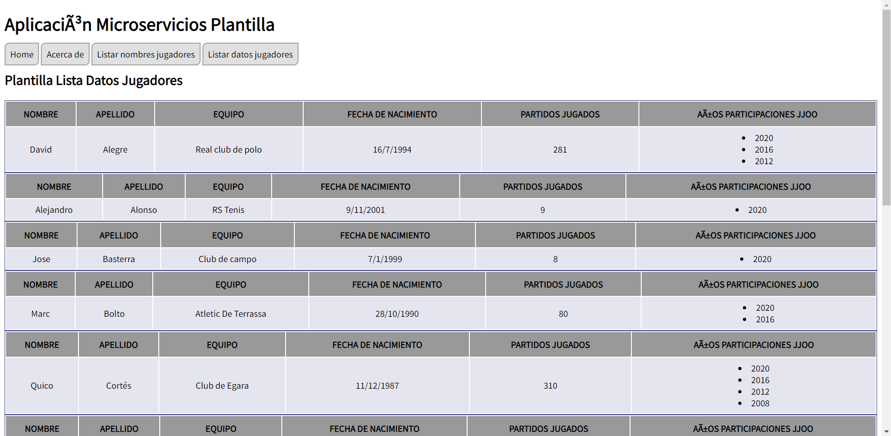

[](https://classroom.github.com/a/hneiFYl3)
# *Plantilla Práctica Microservicios*: Práctica 3

## Datos personales
* Javier Torres Gálvez
* jtg00023@red.ujaen.es

## URL Tablero Trello
https://trello.com/b/R17z9WeZ/desarrollo-%C3%A1gil-pr%C3%A1ctica-3

## Fauna

*Pantalla home de la base de datos* &#8593;

*Pantalla de inicio de la base de datos* &#8593;

*Pantalla de la colección de la base de datos* &#8593;

## Documentos de la base de datos
1.
```
{
  "ref": Ref(Collection("Hockey_sobre_hierba"), "359074367807685209"),
  "ts": 1678724160980000,
  "data": {
    "nombre": "David",
    "apellido": "Alegre",
    "equipo": "Real club de polo",
    "anios_participaciones_jjoo": [
      2020,
      2016,
      2012
    ],
    "partidos_jugados": 281,
    "f_nacimiento": {
      "dia": 16,
      "mes": 7,
      "anio": 1994
    }
  }
}
```
2.
```
{
  "ref": Ref(Collection("Hockey_sobre_hierba"), "359074595171467866"),
  "ts": 1678725629470000,
  "data": {
    "nombre": "Alejandro",
    "apellido": "Alonso",
    "equipo": "RS Tenis",
    "anios_participaciones_jjoo": [
      2020
    ],
    "partidos_jugados": 9,
    "f_nacimiento": {
      "dia": 9,
      "mes": 11,
      "anio": 2001
    }
  }
}
```
3.
```
{
  "ref": Ref(Collection("Hockey_sobre_hierba"), "359099268900848218"),
  "ts": 1678725685950000,
  "data": {
    "nombre": "Jose",
    "apellido": "Basterra",
    "equipo": "Club de campo",
    "anios_participaciones_jjoo": [
      2020
    ],
    "partidos_jugados": 8,
    "f_nacimiento": {
      "dia": 7,
      "mes": 1,
      "anio": 1999
    }
  }
}
```
4.
```
{
  "ref": Ref(Collection("Hockey_sobre_hierba"), "359099351233987162"),
  "ts": 1678725718930000,
  "data": {
    "nombre": "Marc",
    "apellido": "Bolto",
    "equipo": "Atletic De Terrassa",
    "anios_participaciones_jjoo": [
      2020,
      2016
    ],
    "partidos_jugados": 80,
    "f_nacimiento": {
      "dia": 28,
      "mes": 10,
      "anio": 1990
    }
  }
}
```
5.
```
{
  "ref": Ref(Collection("Hockey_sobre_hierba"), "359100075879694937"),
  "ts": 1678725739242000,
  "data": {
    "nombre": "Quico",
    "apellido": "Cortés",
    "equipo": "Club de Egara",
    "anios_participaciones_jjoo": [
      2020,
      2016,
      2012,
      2008
    ],
    "partidos_jugados": 310,
    "f_nacimiento": {
      "dia": 11,
      "mes": 12,
      "anio": 1987
    }
  }
}
```
6.
```
{
  "ref": Ref(Collection("Hockey_sobre_hierba"), "359100284364915289"),
  "ts": 1678725800740000,
  "data": {
    "nombre": "Miquel",
    "apellido": "Delas",
    "equipo": "FC Barcelona",
    "anios_participaciones_jjoo": [
      2020,
      2016,
      2012
    ],
    "partidos_jugados": 264,
    "f_nacimiento": {
      "dia": 3,
      "mes": 4,
      "anio": 1993
    }
  }
}
```
7.
```
{
  "ref": Ref(Collection("Hockey_sobre_hierba"), "359100406457959002"),
  "ts": 1678725820980000,
  "data": {
    "nombre": "Enrique",
    "apellido": "González de Castejon",
    "equipo": "Club de campo",
    "anios_participaciones_jjoo": [
      2020,
      2016
    ],
    "partidos_jugados": 119,
    "f_nacimiento": {
      "dia": 30,
      "mes": 5,
      "anio": 1997
    }
  }
}
```
8.
```
{
  "ref": Ref(Collection("Hockey_sobre_hierba"), "359100472573821530"),
  "ts": 1678725951070000,
  "data": {
    "nombre": "Alvaro",
    "apellido": "Iglesias",
    "equipo": "Club de campo",
    "anios_participaciones_jjoo": [
      2020,
      2016
    ],
    "partidos_jugados": 147,
    "f_nacimiento": {
      "dia": 25,
      "mes": 1,
      "anio": 1991
    }
  }
}
```
9.
```
{
  "ref": Ref(Collection("Hockey_sobre_hierba"), "359100563789447770"),
  "ts": 1678726134180000,
  "data": {
    "nombre": "Xavi",
    "apellido": "Lleonart",
    "equipo": "Real club de Polo",
    "anios_participaciones_jjoo": [
      2020,
      2016,
      2012
    ],
    "partidos_jugados": 208,
    "f_nacimiento": {
      "dia": 20,
      "mes": 2,
      "anio": 1992
    }
  }
}
```
10.
```
{
  "ref": Ref(Collection("Hockey_sobre_hierba"), "359100875731370585"),
  "ts": 1678726151320000,
  "data": {
    "nombre": "Roc",
    "apellido": "Oliva",
    "equipo": "Real club de Polo",
    "anios_participaciones_jjoo": [
      2020,
      2016
    ],
    "partidos_jugados": 175,
    "f_nacimiento": {
      "dia": 2,
      "mes": 11,
      "anio": 1995
    }
  }
}
```
## Incremento 1
Funcionalidades a implementar:
- Boton "Acerca De": Al pulsar el botón de "Acerca de" se desplegará la información del autor de la aplicación

- Listado de nombres de jugadores: Al pulsar el botón de "Lista nombres jugadores" se desplegará una lista con solo los nombres de los jugadores

- Listado de datos de jugadores: Al pulsar el botón de "Lista datos jugadores" se desplegará una lista con todos los datos de los jugadores (nombre, apellido, equipo, años de participación en los JJOO, fecha de nacimiento y partidos jugados en la selección)
